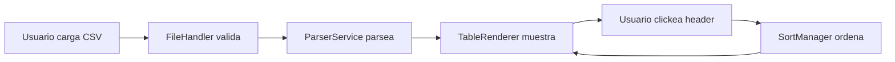

# CSV Data Explorer — TypeScript + PapaParse

[](https://www.typescriptlang.org/)
[](https://vitejs.dev/)
[](https://www.papaparse.com/)


Un visor interactivo de archivos CSV desarrollado con **TypeScript**, **Vite**, **Papa Parse** y arquitectura modular basada en separación estricta de responsabilidades.

Esta aplicación permite cargar un archivo CSV, parsearlo de forma tipada, visualizarlo en una tabla dinámica y ordenarlo por columnas mediante un sistema de ordenamiento estable y type-safe.

---

## 🚀 Características Principales

### ✅ 1. File Handling & Typed Parsing

- ✔ Carga de archivos mediante `<input type="file">`
- ✔ Validación estricta del archivo (`.csv` + tamaño seguro)
- ✔ Parseo asincrónico usando **Papa Parse**
- ✔ Conversión a objetos fuertemente tipados (`CSVRow`)
- ✔ Manejo robusto de errores

### ✅ 2. Dynamic Table Rendering

- ✔ Construcción dinámica del `<table>` según los headers detectados
- ✔ Render de todas las filas tipadas
- ✔ Uso de fragments para render eficiente
- ✔ Actualización del DOM sin recargar la página

### ✅ 3. Type-Safe Column Sorting

- ✔ Ordenamiento estable (ascendente/descendente/none)
- ✔ Funciona con strings, números y valores nulos
- ✔ Indicadores visuales `↑` `↓` en los encabezados
- ✔ Manejado por la clase `SortManager`
- ✔ Comparación locale-aware para strings

### ✅ 4. Row Selection

- ✔ Checkbox in each row for individual selection
- ✔ Visual feedback with `selected` class applied to row and cells
- ✔ Real-time display of selected rows in a paragraph below the table
- ✔ Console logging of selected row data for debugging

### ✅ 5. Arquitectura Limpia y Escalable

El proyecto sigue una separación modular clara:

```
src/
 ├── domain/        # Lógica de negocio pura (SortManager)
 ├── services/      # Procesamiento CSV y manejo de archivos
 ├── ui/            # Render de interfaz y DOM
 ├── types/         # Tipos TypeScript compartidos
 ├── utils/         # Helpers (extensible)
 ├── main.ts        # Entry point
 └── style.css      # Estilos generales
```

---

## 📋 Requerimientos del Proyecto

Este repositorio cumple con todos los requisitos solicitados:

| Requisito                        | Estado |
| -------------------------------- | ------ |
| Git repository                   | ✅      |
| README profesional               | ✅      |
| Uso de Papa Parse con File API   | ✅      |
| Tipado estricto con interfaces   | ✅      |
| Render de tabla dinámica         | ✅      |
| Ordenamiento asc/desc/none       | ✅      |
| Type guards y estabilidad        | ✅      |
| Separación en clases             | ✅      |
| Manejo de errores (file + parse) | ✅      |
| Loading state                    | ✅      |
| Indicador visual de ordenamiento | ✅      |
| tsconfig moderno                 | ✅      |
| Prettier configurado             | ✅      |

---

## 🧱 Arquitectura del Proyecto

### 📂 Capa Services

#### 📄 `FileHandler`

- Valida archivos (tipo, tamaño, contenido)
- Protege contra errores de I/O
- Proporciona feedback claro al usuario

#### 📄 `ParserService`

- Maneja **Papa Parse** con configuración robusta
- Extrae headers automáticamente
- Transforma filas a tipos correctos (`number`, `string`, `null`)
- Ignora errores no críticos como `FieldMismatch`
- Detecta delimitadores automáticamente

### 📂 Capa Domain

#### 📄 `SortManager`

Se encarga del ordenamiento estable:

- Cicla estados: `none` → `asc` → `desc` → `none`
- Comparación numérica inteligente
- Comparación de strings locale-aware
- Soporte para valores nulos (se ordenan al final)
- Mantiene orden original en valores iguales (stable sort)

### 📂 Capa UI

#### 📄 `TableRenderer`

- Render dinámico del `<table>` con headers y filas
- Headers clickeables para ordenamiento
- Indicadores visuales de estado de ordenamiento (`↑` `↓`)
- Limpieza del DOM antes de re-render
- Inferencia automática de headers si no se proveen
- Checkbox column for row selection
- Visual selection state management
- Display selected rows below the table

---

## 🔄 Recent Changes

### Row Selection Feature

**What was added:**
- Checkbox column as the first column in each table row
- Visual selection state with `selected` CSS class
- Paragraph element below table showing selected rows
- Console logging of selected row data

**How it works:**
1. Each row contains a checkbox in the first cell
2. Clicking the checkbox toggles the `selected` class on the row and all its cells
3. `updateSelectedRowsDisplay()` method collects all selected rows and:
   - Extracts row data (excluding checkbox cell)
   - Logs selected data to console
   - Updates the paragraph below the table with selected rows summary

**Implementation details:**
- Uses `getElementsByTagName('td')` to get all cells in a row
- Simple toggle mechanism without complex state management
- Automatically updates display on each checkbox click

---

## ▶️ Cómo Ejecutar el Proyecto

### 1. Clonar el repositorio

```bash
git clone
cd csv-table-viewer-tech-interview/interview-vite
```

### 2. Instalar dependencias

```bash
pnpm install
```

> Alternativamente podés usar `npm install` o `yarn install`

### 3. Ejecutar en modo desarrollo

```bash
pnpm dev
```

El servidor se iniciará en:

<http://localhost:5173>

### 4. Build para producción

```bash
pnpm build
```

Los archivos optimizados se generarán en la carpeta `dist/`

---

## 📁 Estructura del Proyecto
```

csv-table-viewer-tech-interview/
└── interview-vite/
    ├── index.html              # Entrada HTML principal
    ├── package.json            # Dependencias y scripts
    ├── tsconfig.json           # Configuración TypeScript
    ├── .prettierrc             # Reglas de formato de código
    ├── pnpm-lock.yaml          # Lock file de dependencias
    ├── src/
    │   ├── main.ts             # Punto de entrada de la aplicación
    │   ├── style.css           # Estilos globales
    │   ├── domain/
    │   │   └── SortManager.ts  # Lógica de ordenamiento
    │   ├── services/
    │   │   ├── FileHandler.ts  # Validación y manejo de archivos
    │   │   └── ParserService.ts # Parseo de CSV
    │   ├── ui/
    │   │   └── TableRenderer.ts # Renderizado de tabla
    │   ├── types/
    │   │   └── index.ts        # Tipos TypeScript compartidos
    │   └── utils/              # Utilidades (extensible)
    └── public/                 # Archivos estáticos
```

---

## 📄 Tipos TypeScript

### `CSVRow`

Representa una fila de datos CSV con columnas tipadas:

```typescript
export interface CSVRow {
  [column: string]: CSVPrimitive;
}
```

### `CSVPrimitive`

Tipos de valores permitidos en las celdas:

```typescript
export type CSVPrimitive = string | number | boolean | null;
```

### `SortState`

Estados de ordenamiento de columnas:

```typescript
export type SortState = 'asc' | 'desc' | 'none';
```

### `ParseResult`

Resultado del parseo de CSV:

```typescript
export interface ParseResult {
  rows: CSVRow[];
  headers: string[];
}
```

---

## 🔄 Flujo de la Aplicación



1. **Usuario carga archivo** → `FileHandler` valida tipo y tamaño
2. **Archivo válido** → `ParserService` parsea con Papa Parse
3. **Datos parseados** → `TableRenderer` renderiza tabla HTML
4. **Usuario clickea header** → `SortManager` ordena datos
5. **Datos ordenados** → `TableRenderer` actualiza vista

---

## 🎨 Características de Código

### Type Guards

```typescript
private isNumber(value: unknown): value is number {
  return typeof value === 'number' && Number.isFinite(value);
}
```

### Stable Sort

```typescript
// Mantiene orden original en valores iguales
const indexedRows = rows.map((row, originalIndex) => ({
  row,
  originalIndex,
}));
```

### Locale-Aware Comparison

```typescript
stringA.localeCompare(stringB, undefined, {
  numeric: true,      // '10' viene después de '2'
  sensitivity: 'base', // Case-insensitive
});
```
